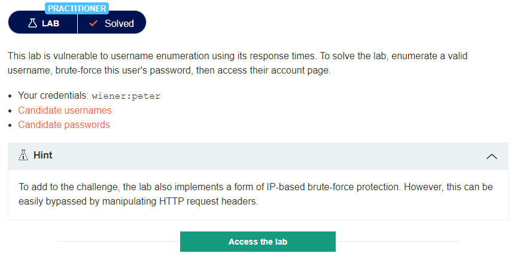

# How To Test Broken Authentication

Authentication is a mechanism put in place to determine if a user is who they say they are, either through a password-based system or any other form of authentication system.

In this article, we’ll be going through how to test for broken authentication, their impact, and how to mitigate them.

**TABLE OF CONTENTS**

---

[*What is broken authentication?*](#What-is-broken-authentication?)

---

*Checklist for broken authentication*

- ***Application Password Functionality***
- ***Additional Authentication Functionality***

---

*Impact of broken authentication*

---

*Prevention of broken authentication*

---

*Tools*

---

*References*

---

1. **What is broken authentication?**
    - Broken authentication is a type of vulnerability that allows attacker to get into a web application without proper credentials
    - This could be carried out either by bypassing the authentication mechanism put in place or by brute-force another user’s account.
    - If the attacker successfully bypassed or brute-force his way into another user’s account, they gain access to all the data and privileges of that user account.
    - According to the OWASP Top 10 2021 report, broken authentication is ranked number 7 and is ranked number 7 and is grouped under Identification and Authentication Failures.
    - This category slipped down from second place and now contains Common Weakness Enumerations (CWEs) relating to identification issues. It was previously known as broken authentication.
    - The severity of this vulnerability can be so high. Say, an attacker was able to brute-force his way into the administrator account of a web application, this means he gets full control over the web application.
    - This article seeks to demonstrate how an attacker tests for broken authentication in a web application and how to prevent them.
2. **Checklist for broken authentication**
    - ***Application Password Functionality***
        - Test for weak lock out mechanism
            - *An example test may be as follows:*
                - [ ]  Attempt to log in with an incorrect password 3 times.
                - [ ]  Successfully log in with the correct password, thereby showing that the lockout mechanism doesn't trigger after 3 incorrect authentication attempts.
                - [ ]  Attempt to log in with an incorrect password 4 times.
                - [ ]  Successfully log in with the correct password, thereby showing that the lockout mechanism doesn't trigger after 4 incorrect authentication attempts.
                - [ ]  Attempt to log in with an incorrect password 5 times.
                - [ ]  Attempt to log in with the correct password. The application returns "Your account is locked out.", thereby confirming that the account is locked out after 5 incorrect authentication attempts.
                - [ ]  Attempt to log in with the correct password 5 minutes later. The application returns "Your account is locked out.", thereby showing that the lockout mechanism does not automatically unlock after 5 minutes.
                - [ ]  Attempt to log in with the correct password 10 minutes later. The application returns "Your account is locked out.", thereby showing that the lockout mechanism does not automatically unlock after 10 minutes.
                - [ ]  Successfully log in with the correct password 15 minutes later, thereby showing that the lockout mechanism automatically unlocks after a 10 to 15 minute period.
            - *The way to fix*
                - Implement a rate limiting system that will prevent any user from attempting more than a set number of login attempts within a given time period.
                - Use strong passwords that are difficult to guess and require the use of special characters and numbers.
                - Implement two-factor authentication (2FA) to verify user identities.
                - Ensure that login attempts are logged and monitored for suspicious activity.
                - If the application allows for it, consider implementing a CAPTCHA system to verify users are human.
                - Ensure that the server and application are running the latest security updates and patches.
                - Utilize a web application firewall (WAF) to protect against common web vulnerabilities.
            - *The way to by pass*
                - Try to reverse engineer the code to find any potential weaknesses that could be exploited to bypass the lock out mechanism.
                - Use a proxy or VPN to mask your IP address and make it harder for the lock out mechanism to detect your attempts to access the website.
            - *Lab demo*
                - Lab link: [https://portswigger.net/web-security/authentication/password-based/lab-username-enumeration-via-response-timing](https://portswigger.net/web-security/authentication/password-based/lab-username-enumeration-via-response-timing)
                - Description:
                    
                    
                    
                - Candidate usernames: [https://portswigger.net/web-security/authentication/auth-lab-usernames](https://portswigger.net/web-security/authentication/auth-lab-usernames)
                - Candidate passwords: [https://portswigger.net/web-security/authentication/auth-lab-passwords](https://portswigger.net/web-security/authentication/auth-lab-passwords)
                - Attack narrative:
                    - **Enumerate username**
                        - As usual, the first step is to analyze the login functionality of lab. I try to log in with some random username and password. As expected, the error message is a generic `Something is wrong`message:
                            
                            
                            
                        - The next step I load the request into Intruder, load the provided username list and add the known good username `wiener`.
                            - Attack type: *Sniper*
                            - Payload: *provided username list* + `wiener`
                        - Unfortunately, this does not result in a serious difference in response times. Upon closer look it becomes obvious why:
                            
                            
                            
                        - Now i  try to do some simple HTTP request header manipulation can bypass this brute force protection. A quick Google search leads to [a page with the correct answer](https://medium.com/r3d-buck3t/bypass-ip-restrictions-with-burp-suite-fb4c72ec8e9c): the `X-Forwarded-For` header.
                        - Adding it with a random value `X-Forwarded-For: abc123` will allow for further login attempts. I guess that using a static value there will just lock it up again, so include this value in the intruder. Using the Battering ram attack type, the `X-Forwarded-For` header will contain the username in each request, providing unique values and bypassing the lockout.
                            
                            
                            
                            - Payload: *provided username list* + `wiener`
                        - Unfortunately, the results are still inconclusive. The response time ranges from 68ms to 132ms. The one known correct username `wiener` is right in the middle of the response time with 93ms.
                        - The one parameter that is definitely checked for valid usernames is the password field. I try using some absurdly long password (other parameters as above) and see how it goes:
                            
                            
                            
                        - Finally, a useful response:
                            
                            
                            
                            ⇒ Valid username: **athena**
                            
                    - **Brute force password**
                        - Now I repeat the step for the password until the correct password is found. I change the value of the `X-Forwarded-For`header to avoid repeating the values of the username enumeration.
                            
                            
                            
                            - Payload: *provided password list*
                        - On successful login, the page redirects, so I remove all responses with 2xx status codes (alternative, filter for responses not containing 'Invalid username or password
                            
                            
                            
                             ⇒ Password for user: **555555**
                            
                    
                    ⇒ I log in with the username and password combination (if the browser is still on lockout, intercept the request and manually add the header), or simply use Burps 'Request in browser' feature to avoid typing results in and the lab updates to
                    
                    
                    
        - Test remember me functionality
            - Look for passwords being stored in a cookie. Examine the cookies stored by the application. Verify that the credentials are not stored in clear text, but are hashed.
            - Examine the hashing mechanism: if it is a common, well-known algorithm, check for its strength; in homegrown hash functions, attempt several usernames to check whether the hash function is easily guessable.
            - Verify that the credentials are only sent during the log in phase, and not sent together with every request to the application.
            - Consider other sensitive form fields (e.g. an answer to a secret question that must be entered in a password recovery or account unlock form).
            - *The way to fix*
                - Implementing strong password policies and using two-factor authentication.
                - Use SSL encryption for all data transmissions and ensure that all passwords are stored in an encrypted format.
                - Use a secure session management system to ensure that the remember me functionality is not exploited by malicious actors.
            - *The way to by pass*
                - Investigate the source code to identify any vulnerabilities in the remember me functionality.
                - Use fuzzing techniques to identify any input validation vulnerabilities.
                - Test for any session hijacking or session fixation vulnerabilities.
        - Test password reset and/or recovery
            - *What information is required to reset the password ?*
                - The first step is to check whether secret questions are required. Sending the password (or a password reset link) to the user email address without first asking for a secret question means relying 100% on the security of that email address, which is not suitable if the application needs a high level of security.
            - *Are reset passwords generated randomly ?*
                - If the application sends or visualizes the old password in clear text because this means that passwords are not stored in a hashed form, which is a security issue in itself.
            - *Is the reset password functionality requesting confirmation before changing the password?*
                - To limit denial-of-service attacks the application should email a link to the user with a random token, and only if the user visits the link then the reset procedure is completed. This ensures that the current password will still be valid until the reset has been confirmed.
            - *The way to fix*
                - Check the password reset configuration settings to make sure they are correct.
                - Check if the password reset code is valid and if it has expired.
                - Try resetting the password using a different browser or device.
        - Test password change process
            - *Is the old password requested to complete the change?*
                - The most insecure scenario here is if the application permits the change of the password without requesting the current password. Indeed if an attacker is able to take control of a valid session they could easily change the victim's password.
            - *The way to fix*
                - Check the code that handles the password change process.
                - Check for any vulnerabilities related to the password change process, such as SQL injection, cross-site scripting, etc.
        - Test CAPTCHA
            - Verify the time duration in which the captcha is loaded on the webpage.
            - Test captcha should not be by passed by clicking on the captcha multiple time when the captcha is not loaded and shown on the webpage during web page loading.
            - Check the time out for the Captcha. The time in which the captcha become unchecked.
            - Test the captcha on slow internet. An invalid captcha error message should not be shown.
            - Verify the captcha and click on the submit button two times. It should not display an invalid captcha error.
            - *The way to fix*
                - Make sure the CAPTCHA is enabled and configured correctly on the web server.
                - Check the browser settings to ensure that JavaScript and Cookies are enabled.
                - Check the server log files to identify any errors that could be causing the CAPTCHA to fail.
                - Test the CAPTCHA with different browsers and devices to identify any compatibility issues.
        - Test multi-factor authentication
            - *User registration*
                - When a user registers for an app, they are usually asked to input their name and email address. To validate the email address, the app sends an email containing a confirmation link. After the user receives the link and opens it, they can continue with registration.
            - *Device Authentication*
                - Sometimes, users need to access their email from a new device. To distinguish the real login from a hacking attempt, the email vendor sends a suspicious activity alert and SMS containing an OTP to the registered mobile number. The user logs into the application with the OTP. The security notification alerts the user if there is a security breach.
            - *Password reset*
                - Whenever a user requests a password reset, an OTP goes to the phone number associated with the app. Again, the user enters the OTP and moves on to resetting the password.
            - *The way to fix*
                - Ensure that you are using the correct password.
                - Check if the system is blocking your IP address through firewall or other security measures.
                - Try using different browsers or devices for authentication.
                - Ensure that the system is using strong passwords and not default passwords.
            - *The way to by pass*
                - There is no single answer to this question as it depends on the type of multi-factor authentication being used. For example, if the authentication method is biometric authentication, then a method such as spoofing may be used to bypass it. Alternatively, if the authentication method is password-based authentication, then a method such as brute-forcing may be used.
        - Test for default login
            - Check the limit on the total number of unsuccessful login attempts. So that a user cannot use a brute-force mechanism to try all possible combinations of username-password.
            - Verify that in case of incorrect credentials, a message like “incorrect username or password” should get displayed. Instead of an exact message pointing to the incorrect field.
            - Verify the login session timeout duration. So, once logged in a user cannot be authenticated for a lifetime.
            - *The way to fix*
                - Check the server logs for any errors or failed login attempts.
                - Ensure that the credentials being used are correct and the username is not being mistyped.
                - If the user is still unable to login, reset their password and provide them with a new one.
            - *The way to by pass*
                - The best way to bypass default login failures on a web penetration test is to use brute force or dictionary attacks. Brute force attacks involve trying every possible combination of characters in a password field to try and gain access. Dictionary attacks involve trying words from a dictionary or pre-defined list of commonly used passwords.
        - Test for weak security question/answer
            - *Testing for weak  pre-generated questions*
                - Try to obtain a list of security questions by creating a new account or by following the “I don’t remember my password”-process.
                - Try to generate as many questions as possible to get a good idea of the type of security questions that are asked.
            - *Testing for weak self-generated questions*
                - Try to create security questions by creating a new account or by configuring your existing account’s password recovery properties.
            - *The way to fix*
                - Ensure that your security questions are sufficiently difficult to guess.
                - Make sure that the answers to your security questions are stored in a secure and encrypted format.
                - Implement CAPTCHAs when users attempt to reset their security questions and/or answers.
    - ***Additional Authentication Functionality***
        - Test for account enumeration and guessable user account base on HTTP Response Message
            - *Check the valid credentials*
                - Record the server answer when you submit a valid user ID and valid password
            - *Testing for valid user with wrong password*
                - Insert a valid user ID and a wrong password and record the error message generated by the application. The browser should display a message:
                
                
                
                       or unlike any message that reveals the existence of the user like the following:
                
                *`Login for User foo: invalid password`*
                
            - *Testing for a Nonexistent Username*
                - Insert an invalid user ID and a wrong password and record the server answer (the tester should be confident that the username is not valid in the application). Record the error message and the server answer. If the tester enters a nonexistent user ID, they can receive a message similar to :
                    
                    
                    
                    *or a message like the following one:*
                    
                    *`Login failed for User foo: invalid Account`*
                    
            - The way to fix
                - Implement account lockout policies: Make sure that after a certain number of unsuccessful login attempts, the account is locked. This will prevent attackers from enumerating accounts by simply trying different passwords.
                - Limit access privileges: Only give users the access they need to perform their job. This will reduce the chances of a user's account being compromised.
        - Test for authentication bypass schema
            - *Direct page request*
                - If a web application implements access control only on the log in page, the authentication schema could be bypassed. For example, if a user directly requests a different page via forced browsing, that page may not check the credentials of the user before granting access. Attempt to directly access a protected page through the address bar in your browser to test using this method.
            - *Session ID Prediction*
                - Many web applications manage authentication by using session identifiers (session IDs). Therefore, if session ID generation is predictable, a malicious user could be able to find a valid session ID and gain unauthorized access to the application, impersonating a previously authenticated user. In the following figure, values inside cookies increase linearly, so it could be easy for an attacker to guess a valid session ID.
            - *The way to fix*
                - Start by ensuring that the authentication is set up correctly and the permissions are correctly applied.
                - Create strong passwords and require users to change them regularly.
                - Limit the number of failed login attempts to prevent brute force attacks.
        - Test for brute force protection
            - How often can a user change their password? How quickly can a user change their password after a previous change?
                - What characters are permitted and forbidden for use within a password? Is the user required to use characters from different character sets such as lower and uppercase letters, digits and special symbols?
            - When must a user change their password? After 90 days? After account lockout due to excessive log on attempts?
            - How different must the next password be from the last password?
            - Is the user prevented from using his username or other account information (such as first or last name) in the password?
            - *The way to fix*
                - Implement strong password policies.
                - Use CAPTCHA.
                - Implement IP blocking.
                - Use a Web Application Firewall.
            - The way to by pass
                - Using a dictionary attack, which involves trying multiple passwords in rapid succession. We can find the dictionary attack tool on github. Here is an example on link [https://github.com/LandGrey/pydictor](https://github.com/LandGrey/pydictor)
        - Test for credentials transports over an encrypted channel
            - *Sending data with POST method through HTTP*
                
                Suppose that the login page presents a form with fields User, Pass, and the Submit button to authenticate and give access to the application. If we look at the headers of our request with WebScarab we can get something like this:
                
            
            ```
            POST http://www.example.com/AuthenticationServlet HTTP/1.1
            Host: www.example.com
            User-Agent: Mozilla/5.0 (Windows; U; Windows NT 5.1; it; rv:1.8.1.14) Gecko/20080404
            Accept: text/xml,application/xml,application/xhtml+xml
            Accept-Language: it-it,it;q=0.8,en-us;q=0.5,en;q=0.3
            Accept-Encoding: gzip,deflate
            Accept-Charset: ISO-8859-1,utf-8;q=0.7,*;q=0.7
            Keep-Alive: 300
            Connection: keep-alive
            Referer: http://www.example.com/index.jsp
            Cookie: JSESSIONID=LVrRRQQXgwyWpW7QMnS49vtW1yBdqn98CGlkP4jTvVCGdyPkmn3S!
            Content-Type: application/x-www-form-urlencoded
            Content-length: 64
            
            delegated_service=218&User=test&Pass=test&Submit=SUBMIT
            
            ```
            
            From this example the tester can understand that the POST request sends the data to the page *www.example.com/AuthenticationServlet* using HTTP. So the data is transmitted without encryption and a malicious user could intercept the username and password by simply sniffing the network with a tool like Wireshark.
            
            - *Sending data with POST method through HTTPS*
            
            Suppose that our web application uses the HTTPS protocol to encrypt the data we are sending (or at least for transmitting sensitive data like credentials). In this case, when logging on to the web application the header of our POST request would be similar to the following:
            
            ```
            POST https://www.example.com:443/cgi-bin/login.cgi HTTP/1.1
            Host: www.example.com
            User-Agent: Mozilla/5.0 (Windows; U; Windows NT 5.1; it; rv:1.8.1.14) Gecko/20080404
            Accept: text/xml,application/xml,application/xhtml+xml,text/html
            Accept-Language: it-it,it;q=0.8,en-us;q=0.5,en;q=0.3
            Accept-Encoding: gzip,deflate
            Accept-Charset: ISO-8859-1,utf-8;q=0.7,*;q=0.7
            Keep-Alive: 300
            Connection: keep-alive
            Referer: https://www.example.com/cgi-bin/login.cgi
            Cookie: language=English;
            Content-Type: application/x-www-form-urlencoded
            Content-length: 50
            
            Command=Login&User=test&Pass=test
            
            ```
            
            We can see that the request is addressed to *www.example.com:443/cgi-bin/login.cgi* using the HTTPS protocol. This ensures that our credentials are sent using an encrypted channel and that the credentials are not readable by a malicious user using a sniffer.
            
            - The way to fix
                - Use a secure web protocol such as HTTPS or FTPS instead of plain HTTP or FTP.
                - Use a VPN for secure remote access and data transmissions.
                - Regularly monitor your web server’s logs for any suspicious activity.
        - Test for weaker authentication in alternative channel
            - *Identify other channels by using the following methods:*
                - Reading site content, especially the home page, contact us, help pages, support articles and FAQs, T&Cs, privacy notices, the robots.txt file and any sitemap.xml files.
                - Searching HTTP proxy logs, recorded during previous information gathering and testing, for strings such as “mobile”, “android”, blackberry”, “ipad”, “iphone”, “mobile app”, “e-reader”, “wireless”, “auth”, “sso”, “single sign on” in URL paths and body content.
                - Use search engines to find different websites from the same organization, or using the same domain name, that have similar home page content or which also have authentication mechanisms
            - *Enumerate Authentication Functionality*
                - For each alternative channel where user accounts or functionality are shared, identify if all the authentication functions of the primary channel are available, and if anything extra exists. It may be useful to create a grid like the one below:
                    
                    
                    
            - *The way to fix*
                - Ensure that all authentication mechanisms are configured to use strong passwords or passphrases.
                - Implement an account lockout policy that locks out an account after several failed login attempts.
                - Review and update your security policies to ensure that they are up to date with the latest security best practices.
3. **Impact of broken authentication**
    - Compromising an account allows the attacker access to unauthorized information.
    - It could lead to full application takeover.
    - Loss of sensitive and confidential business information.
4. **Prevention of broken authentication**
    - [Don’t expose sessions IDs in URLs](https://julienprog.wordpress.com/2017/08/17/session-id-in-the-url-is-it-a-vulnerability/) - [Session fixation attack](https://www.netsparker.com/blog/web-security/session-fixation-attacks/) is a vulnerability that allows an attacker to hijack a user session. (often in Java)
    - [Don’t give room for user enumeration](https://www.virtuesecurity.com/kb/username-enumeration/) - It’s critical to utilize identical, generic error messages and to double-check that they’re the same. With every login request, you should return the same HTTP status code.
    - [Implement a strong password policy](https://en.wikibooks.org/wiki/Web_Application_Security_Guide/Password_security) - Allowing the use of weak and well-known passwords is not a good idea. After a given number of login attempts, require users to pass a CAPTCHA test.
    - [brute-force protection](https://predatech.co.uk/protecting-your-web-app-brute-force-login-attacks/) - prevent brute-force login attempts.
    - [Multi-factor authentication](https://auth0.com/docs/secure/multi-factor-authentication/step-up-authentication/configure-step-up-authentication-for-web-apps) - provides an extra layer of security for users.
    - Bot detection - Bot detection is designed to combat credential stuffing and other forms of bot-driven attacks. It works by correlating a variety of internal and external data sources to identify and mitigate bot-driven attacks before login. When an IP address is deemed suspicious, it is presented with a CAPTCHA on login, which prevents most bot attacks from successfully authenticating.
    - Breached Password Detection - A Credential stuffing attacks are a major threat to any web application. These attacks rely on users reusing a password that was previously compromised in another breach. Auth0 keeps a continually updated database of known breached credentials. When a user is detected using breached credentials, admins can choose to warn them but allow the login, deny the login and force a password reset, or trigger MFA.
5. **Tools**
    - Burp Suite: [https://portswigger.net/burp/documentation/desktop/testing-workflow](https://portswigger.net/burp/documentation/desktop/testing-workflow)
    - OWSAP ZAP: [https://www.zaproxy.org/getting-started/](https://www.zaproxy.org/getting-started/)
6. **References**
    - [https://auth0.com/resources/whitepapers/broken-auth-checklist](https://auth0.com/resources/whitepapers/broken-auth-checklist)
    - [https://owasp.org/www-project-web-security-testing-guide/latest/4-Web_Application_Security_Testing/04-Authentication_Testing/README](https://owasp.org/www-project-web-security-testing-guide/latest/4-Web_Application_Security_Testing/04-Authentication_Testing/README)
    - [https://rnpg.ir/Documents/WSTG-V4.2.pdf](https://rnpg.ir/Documents/WSTG-V4.2.pdf)
    - [https://github.com/harshinsecurity/web-pentesting-checklist](https://github.com/harshinsecurity/web-pentesting-checklist)
    - [https://www.breachlock.com/resources/blog/web-application-penetration-testing-checklist/](https://www.breachlock.com/resources/blog/web-application-penetration-testing-checklist/)
    - [https://book.hacktricks.xyz/pentesting-web/2fa-bypass](https://book.hacktricks.xyz/pentesting-web/2fa-bypass)
