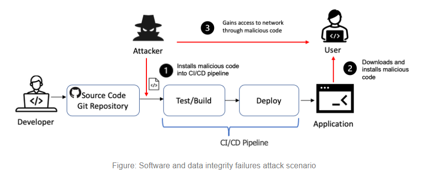

# How To Test Software and Data Integrity Failures

Modern software development is characterized by agile principles that encourage the rapid release and update cycles. Agile methodology’s core components require strict integrity checks, without which **[attackers can inject malicious inputs](https://crashtest-security.com/7-signs-that-your-website-has-been-hacked/)** that can potentially impact all deployment pipeline stages. In most instances, insecure design is one of the most commonly attributed causes that lead to a broad category of application security vulnerabilities – collectively known as **software and data integrity failures**.

In this article, we’ll be going through how to test for software and data integrity failures, their impact, and how to mitigate them.

**TABLE OF CONTENTS**

---

*What is Software and Data Integrity Failures?*

---

*Checklist for Software and Data Integrity Failures*

---

*Impact of Software and Data Integrity Failures*

---

*Prevention of Software and Data Integrity Failures*

---

*Tools*

---

*References*

1. **What is Software and Data Integrity Failures?**
    - Software and data integrity failures relate to code and infrastructure that does not protect against integrity violations. This can occur when you use software from untrusted sources and repositories or even software that has been tampered with at the source, in transit, or even the endpoint cache. Attackers can exploit this to potentially introduce unauthorized access, malicious code, or system compromise as part of the following attacks:
        - Cache Poisoning
        - Code injection
        - Command execution
        - Denial of Service
    - Software and data integrity failures attack scenario
        - In the following scenario an attacker exploits an insecure CI/CD pipeline and installs malicious code to be distributed through the build and deploy process.
            1. The attacker identifies an organizations' insecure CI/CD pipeline and installs malicious code that is pushed into production.
            2. Customers unknowingly download the malicious code from the organizations update servers.
            3. The malicious update is installed in the customer's environment.
            4. The attacker uses the malicious code to gain access to the customer's network.
        
        
        
2. **Checklist for Software and Data Integrity Failures**
    - *Check the security of the data and software serving system.*
        - Perform vulnerability scans: Using automated tools to identify any vulnerabilities in the system.
        - Perform penetration tests: Simulating an attack on the system to identify any security weaknesses that can be exploited.
        - Test authentication and authorization: Testing the system’s ability to ensure that only authorized users can access the system and its data.
        - Monitor system activity: Monitoring system activity to track any suspicious or malicious behavior.
        - *The way to fix*
            - Perform vulnerability scans and penetration tests on the web application to identify weaknesses and potential attack vectors.
            - Ensure all software and data is regularly patched using the latest security updates.
            - Limit access to the web server to only authorized personnel.
        - *Lab demo*
            - Lab link: [https://portswigger.net/web-security/deserialization/exploiting/lab-deserialization-modifying-serialized-data-types](https://portswigger.net/web-security/deserialization/exploiting/lab-deserialization-modifying-serialized-data-types)
            - Description:
                
                
                
            - Attack narrative:
                - **Analysis**
                    - The vulnerability is in authenticated functionality, so I log in with the known credentials of `wiener`and look at the response:
                        
                        
                        
                    - The application stores a session cookie after login. It is visible that it ends with two URL-encoded `=` characters. That is a strong indication that the cookie is base64-encoded.I send the string to Burp Decoder and look at its content:
                        
                        
                        
                    - It contains two values, my `username`and an `access_token`.
                - **The unintended way**
                    - I wonder what will happen if I set the username to `administrator`
                     and use a boolean as the access code.
                        
                        
                        
                    - The base64-encoded string does not end with `=`, so no URL-encoding is required. I store the string in my cookie and refresh the page. The result is somewhat unexpected and very interesting. It shows an internal server error that shows me all access tokens.
                        
                         ⇒ I change to another type of access code.
                        
                - **The intended payload**
                    - Trying a boolean value for the access code did not work the intended way, so I retry using an integer value:
                        
                        
                        
                    - I store it in the browser and refresh the page:
                        
                        
                        
                
                ⇒ The lab is solve.
                
                
                
    - *Check the configuration of the system, software configuration and hardware.*
        - System configuration testing.
        - Software configuration testing.
        - Hardware configuration testing.
        - Testing for compatibility: Verifying that the system, software and hardware are working together correctly.
        - *The way to fix*
            - System Configuration:
                - Check system logs to identify any errors or warnings
                - Check system settings to ensure they are properly configured
                - Check system resources to ensure they are being used efficiently
                - Check system security settings to ensure they are up to date
                - Check system applications to ensure they are running correctly
            - Software Configuration:
                - Check software versions to ensure they are up to date
                - Check system settings to ensure they are properly configured
                - Check application settings to ensure they are properly configured
                - Check application permissions to ensure they are set correctly
                - Check system resources to ensure they are being used efficiently
            - Hardware Failure:
                - Check hardware components to identify any physical damage
                - Check for loose connections or cables
                - Check for any signs of overheating
                - Check for any failed components
                - Check for any signs of electrostatic discharge
    - *Check all software and operating system updates.*
        - Use automated software updaters and patch management tools
        - Use Windows  updates
        - Install antivirus software
        - Use third-party patch management tools.
        - *The way to fix*
            - The best way to fix any software and operating system updates that fail in a penetration test is to first identify the issue causing the failure. This can be done by running a thorough scan of the system, reviewing the system logs, and checking the application and operating system versions. Once the issue is identified, the appropriate patch or update can be applied to fix the vulnerability or issue.
    - *Check the software, services and tools on the server.*
        - Testing the software by running tests on the software’s source code: Make sure that all features are working as expected.
        - Test services by running tests that evaluate their performance and reliability: Use a combination of black box tests to identify any issues, and white box tests to ensure that the code itself is up to standards.
        - Test tools by running tests that evaluate their usability, accuracy and scalability: Use automated tests to ensure that the tools are running as expected, and manual tests to ensure that the user experience is satisfactory.
    - *Check the data backups are carried out correctly.*
        - Check for the most recent backup and make sure it is up to date.
        - Restore the most recent backup in a test environment and verify that the data is intact.
        - Check the log files for any errors or warnings related to the backup process.
        - Check the media and storage devices used for the backup to make sure they are in good condition and secure.
    - *Check the level of security of network connections and devices to ensure that data is protected.*
        - Use security audits: Make sure that all security protocols and configurations are in place and up to date.
        - Use intrusion detection software: Detect and investigate suspicious activity on your network. It includes unauthorized access attempts, malicious software and other malicious activities.
        - Monitoring network traffic: Monitor network traffic for any unusual or unexpected activity. It includes monitoring for unexpected connections, traffic spikes and traffic patterns.
        - *The way to fix*
            - Implement a strong security policy. Make sure that all devices connected to the network are configured with the most secure settings.
            - Utilize firewalls and intrusion detection systems to monitor and protect network connections.
            - Implement a strict password policy and ensure that all passwords are changed frequently.
            - Ensure that all software is up-to-date with the latest security patches.
3. **Impact of Software and Data Integrity Failures**
    - Can have serious consequences for businesses, customers, and users.
    - Without a reliable software and data integrity system, organizations are at risk of losing important information or having their systems or data corrupted.
    - Lead to operational disruptions and security breaches, which can lead to a breach of customer privacy and confidential information
4. **Prevention of Software and Data Integrity Failures**
    - Authentication: Authentication makes sure that the data is coming from and going to a valid and trusted source.
    - User-level restrictions: It is essential to make sure that the libraries and dependencies used in the system are coming from trusted and verified sources and have restricted access.
    - Encrypt and validate all data: It is essential to make sure that all data is encrypted before sharing. All data must go through an extensive integrity check and should be backed up by a digital signature. This method will help the user gain access to valid data and protect the system from attackers.
    - Firewalls: Build strong firewalls to make sure that no malicious code sneaks into the system.
    - Update security checks: Keep updating the system with new and strong security measure
5. **Tools**
    - Burp Suite: [https://portswigger.net/burp/documentation/desktop/testing-workflow](https://portswigger.net/burp/documentation/desktop/testing-workflow)
    - Nmap: [https://www.varonis.com/blog/nmap-commands](https://www.varonis.com/blog/nmap-commands)
    - Nikto: [https://null-byte.wonderhowto.com/how-to/scan-for-vulnerabilities-any-website-using-nikto-0151729/](https://null-byte.wonderhowto.com/how-to/scan-for-vulnerabilities-any-website-using-nikto-0151729/)
6. **References**
    - [https://owasp.org/www-project-cyclonedx/](https://owasp.org/www-project-cyclonedx/)
    - [https://owasp.org/www-project-dependency-check/](https://owasp.org/www-project-dependency-check/)
    - [https://crashtest-security.com/supply-chain-attack/](https://crashtest-security.com/supply-chain-attack/)
    - [https://crashtest-security.com/ci-cd-pipeline/](https://crashtest-security.com/ci-cd-pipeline/)
    - [https://security.packt.com/owasp-top-10-a082021-software-and-data-integrity-failures/](https://security.packt.com/owasp-top-10-a082021-software-and-data-integrity-failures/)
    - [https://foresite.com/blog/owasp-top-10-8-software-and-data-integrity-failures](https://foresite.com/blog/owasp-top-10-8-software-and-data-integrity-failures/) (technique by pass)
