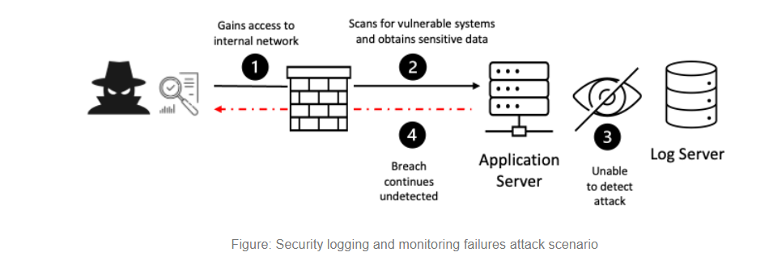

# How To Test Security Logging and Monitoring Failures

Security logging and monitoring came from the Top 10 community survey (#3), up slightly from the tenth position in the OWASP Top 10 2017. Logging and monitoring can be challenging to test, often involving interviews or asking if attacks were detected during a penetration test. There isn't much CVE/CVSS data for this category, but detecting and responding to breaches is critical. Still, it can be very impactful for accountability, visibility, incident alerting, and forensics.

In this article, we’ll be going through how to test for security logging and monitoring failures, their impact, and how to mitigate them.

**TABLE OF CONTENTS**

---

*What is Security Logging and Monitoring Failures?*

---

*Checklist for Security Logging and Monitoring Failures*

---

*Impact of Security Logging and Monitoring Failures*

---

*Prevention of Security Logging and Monitoring Failures*

---

*Tools*

---

*References*

1. **What is Security Logging and Monitoring Failures?**
    - Security logging and monitoring failures are frequently a factor in major security incidents. The BIG-IP system includes advanced logging and monitoring functionality and provides security features to protect against attacks that can result from insufficient system and application logging and monitoring.
    - Failure to sufficiently log, monitor, or report security events, such as login attempts, makes suspicious behavior difficult to detect and significantly raises the likelihood that an attacker can successfully exploit your application. For example, an attacker may probe your application or software components for known vulnerabilities over a period. Allowing such probes to continue undetected increases the likelihood that the attacker ultimately finds a vulnerability and successfully exploits the flaw.
    - Insufficient logging, monitoring, or reporting makes your application susceptible to attacks that target any part of the application stack. For example, the following attack types may result from a failure to log, monitor, or report security events:
        - Code injection
        - Buffer overflow
        - Command injection
        - Cross-site scripting (XSS)
        - Forceful browsing
    - Security logging and monitoring failures attack scenario
        
        In the following scenario an attacker exploits an organization that does not use adequate logging and monitoring.
        
        - [ ]  An attacker gains access to an organization's internal network.
        - [ ]  The attacker runs a scanning tool to locate internal systems with known vulnerabilities and obtains sensitive data.
        - [ ]  Since the organization does not follow adequate logging and monitoring practices, they are unable to detect active attacks.
        - [ ]  The data breach continues undetected for months.
        
        
        
2. **Checklist for Security Logging and Monitoring Failures**
    - Establish a baseline for normal activity
        - [ ]  Establish a baseline of expected activity by reviewing the logs over a period of times
        - [ ]  Identify the type and number of events that are usually logged.
        - [ ]  Set thresholds for the number and types of events that can be considered normal.
        - [ ]  Review the logs on a regular basis to ensure that the established thresholds are not exceeded.
        - [ ]  Compare the logs to the baseline to identify any unexpected activity.
    - Monitor log files
        - [ ]  Launch your security logging software.
        - [ ]  Establish the parameters for your log files.
        - [ ]  Monitor the logs for any suspicious activity or items.
        - [ ]  If any suspicious activity or items are identified, investigate further.
        - [ ]  Create automated alerts for any suspicious activity or items.
        - [ ]  Review the logs on a regular basis to ensure all activity is legitimate.
        - [ ]  Investigate any discrepancies or issues.
        - [ ]  Update the security logging software if needed.
        - [ ]  Ensure that security logs are properly backed up and archived.
        - [ ]  Regularly review system access logs to detect any unauthorized access attempts.
        - *The way to fix*
            - Check the log files for errors. Look for any errors or warnings that may be related to the issue.
            - Ensure that the log file path is correct and that the file is accessible.
            - Check the disk space of the server. Make sure that the disk has enough space to store the log files.
            - Ensure that the log file is configured properly.
    - Monitor user accounts
        - [ ]  Regularly review the security logs of all user accounts on the system. Look for any unusual activity that may indicate possible malicious behavior.
        - [ ]  Monitor for failed logins and investigate if any of the failed attempts are coming from unauthorized IP addresses.
        - [ ]  Use an intrusion detection system to monitor for suspicious activity.
        - [ ]  Implement two-factor authentication to ensure that only authorized users can access the system.
        - [ ]  Educate users on the importance of using strong passwords and updating them regularly.
        - [ ]  Implement a password policy that requires users to change their passwords after a certain period of time.
        - [ ]  Regularly review the system for any unauthorized user accounts.
        - [ ]  Implement a system that immediately notifies the IT team when a new user account is created.
        - [ ]  Periodically review the permissions granted to each user account to ensure they are appropriate.
        - *The way to fix*
            - Identify the user accounts that are failing the pentest web.
            - Check the server logs for any suspicious activities related to user accounts.
            - Ensure that the user accounts are configured properly with the right privileges and permissions.
        - *Lab demo*
            - Lab link: [https://curiositykillscolby.com/2020/12/27/hacking-owasps-juice-shop-pt-61-leaked-access-logs/](https://curiositykillscolby.com/2020/12/27/hacking-owasps-juice-shop-pt-61-leaked-access-logs/)
            - Description: [https://pwning.owasp-juice.shop/part2/sensitive-data-exposure.html](https://pwning.owasp-juice.shop/part2/sensitive-data-exposure.html)
            - I also find another description of lab: ***As the challenge name implies, your task is to find some leaked access logs which happen to have a fairly common format. A very popular help platform for developers might contain breadcrumbs towards solving this challenge. The actual log file was copied & paste onto a platform often used to share data quickly with externals or even just internal peers. Once you found and harvested the important piece of information from the log, you could employ a technique called Password Spraying to solve this challenge.***
            - Attack narrative:
                - The first thing that stuck out to me was the developer help site part. That *had* to be stackoverflow.com. And the copy and paste platform? I’d be willing to bet that’s probably pastebin.com.
                - Turns out he does have an account, and he’s asked some questions, and one of those questions does indeed have a link to an entry on Pastebin.
                - I searched for the string “password” in the log data and found this entry:
                    
                    `161.194.17.103 - - [27/Jan/2019:11:18:35 +0000] "GET /rest/user/change-password?current=0Y8rMnww$*9VFYE§59-!Fg1L6t&6lB&new=sjss22%@%E2%82%AC55jaJasj!.k&repeat=sjss22%@%E2%82%AC55jaJasj!.k8 HTTP/1.1" 401 39 "http://localhost:3000/" "Mozilla/5.0`
                    
                - So it looks like the current password was `0Y8rMnww$*9VFYE§59-!Fg1L6t&6lB`
                 and the user was attempting to change it to either `sjss22%@%E2%82%AC55jaJasj!.k`
                 or `sjss22%@%E2%82%AC55jaJasj!.k8`
                - Now i login to the web Juice Shop with account admin by some technique SQL injection
                    
                    
                    
                - I guess the web has the folder for the administrator so that i try to:
                    
                    
                    
                    ⇒ I have to log in with the folder which have all the the valid account user.
                    
                - Now i continue try to login each user with the list of valid account and the password `0Y8rMnww$*9VFYE§59-!Fg1L6t&6lB`
                    
                    ⇒ I see that [J12934@juice-sh.op](mailto:J12934@juice-sh.op) and thankfully the password `0Y8rMnww$*9VFYE§59-!Fg1L6t&6lB`
                     worked and I was in.
                    
                    
                    
    - Monitor network traffic
        - [ ]  Set up a network monitoring tool such as Wireshark or a packet analyzer.
        - [ ]  Create a baseline of the normal network traffic you expect to see on the network.
        - [ ]  Monitor the network traffic for any suspicious activity.
        - [ ]  Look for any traffic that is out of the ordinary.
        - [ ]  Monitor the network traffic for any unauthorized access attempts.
        - [ ]  Check for any malicious applications or programs running on the network.
        - [ ]  Check for any changes to the system configuration that could indicate a malicious attack.
        - [ ]  Look for any signs of data manipulation or data theft.
        - [ ]  Monitor for any suspicious user activity.
        - [ ]  Look for any suspicious outgoing traffic.
        - *The way to fix*
            - Ensure that you have the correct network settings configured. Check the IP address, subnet mask, default gateway, and DNS servers.
            - Ensure that your firewall is configured correctly. Make sure that the necessary ports are opened and that the traffic is being allowed through.
            - Check that your network adapter is functioning properly. Run diagnostic tests to make sure it’s working.
    - Implement access control
        - [ ]  Implement authentication: Implement authentication methods such as username/password, two-factor authentication, or biometric authentication to ensure that only authorized users are able to access the system.
        - [ ]  Establish access controls: Establish access controls that limit user access to only the data and resources they require to do their job. Also, consider using role-based access control to limit access to the most sensitive data.
        - [ ]  Monitor user access: Monitor user access to the system and log any suspicious activity. Make sure to review logs regularly to ensure that users are not accessing data or resources that they should not have access to.
        - [ ]  Enforce password security: Enforce strong password policies and ensure that users are changing their passwords on a regular basis.
        - [ ]  Implement encryption: Implement encryption methods such as SSL/TLS to protect data in transit and at rest.
        - [ ]  Regularly test security: Regularly test the security of the system using penetration testing and vulnerability scanning tools to identify any potential security issues.
    - Investigate security incidents
        - [ ]  Identify the root cause of the incident: Collect logs from all relevant systems, review available evidence, and identify the source of the incident.
        - [ ]  Investigate further: Check for any indicators of compromise, such as malware, unauthorized access, or malicious activity.
        - [ ]  Take immediate action: If any malicious activity is detected, take immediate action to contain the incident and prevent further damage.
3. **Impact of Security Logging and Monitoring Failures**
    - The impact of security logging and monitoring failures can be significant. Without logs and monitoring, an organization may not detect malicious activity until it is too late. This can lead to data theft, data corruption, and financial losses.
    - Failing to detect malicious activity in a timely manner can result in reputational damage and legal liability for the organization.
    - Inadequate logging and monitoring can impede investigations into malicious activity, making it more difficult to track down perpetrators.
    - Without logging and monitoring, an organization may not be able to effectively identify and address security weaknesses.
4. **Prevention of Security Logging and Monitoring Failures**
    - Ensure all login, access control, and server-side input validation failures can be logged with sufficient user context to identify suspicious or malicious accounts and held for enough time to allow delayed forensic analysis.
    - Ensure that logs are generated in a format that log management solutions can easily consume.
    - Ensure log data is encoded correctly to prevent injections or attacks on the logging or monitoring systems.
    - Ensure high-value transactions have an audit trail with integrity controls to prevent tampering or deletion, such as append-only database tables or similar.
    - DevSecOps teams should establish effective monitoring and alerting such that suspicious activities are detected and responded to quickly.
5. **Tools**
    - Burp Suite: [https://portswigger.net/burp/documentation/desktop/testing-workflow](https://portswigger.net/burp/documentation/desktop/testing-workflow)
    - Ffuf: [https://www.freecodecamp.org/news/web-security-fuzz-web-applications-using-ffuf/](https://www.freecodecamp.org/news/web-security-fuzz-web-applications-using-ffuf/)
    - Wireshark: [https://www.comptia.org/content/articles/what-is-wireshark-and-how-to-use-it](https://www.comptia.org/content/articles/what-is-wireshark-and-how-to-use-it)
6. **References**
    - [https://owasp.org/Top10/A09_2021-Security_Logging_and_Monitoring_Failures/](https://owasp.org/Top10/A09_2021-Security_Logging_and_Monitoring_Failures/)
    - [https://github.com/OWASP/www-project-top-10-low-code-no-code-security-risks/blob/main/content/en/LCNC-SEC-10-Security-Logging-and-Monitoring-Failures.md](https://github.com/OWASP/www-project-top-10-low-code-no-code-security-risks/blob/main/content/en/LCNC-SEC-10-Security-Logging-and-Monitoring-Failures.md)
    - [https://github.com/RedHatInsights/secure-coding-checklist/blob/master/README.md#error-handling-and-logging](https://github.com/RedHatInsights/secure-coding-checklist/blob/master/README.md#error-handling-and-logging)
