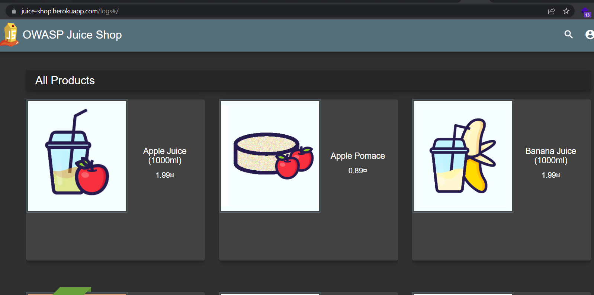

# Penetration Test Report Security Logging and Monitoring Failures

**Table of Contents**

Sample For Testing

Attack Narrative

1. ***Sample For Testing***
    - Lab on Juice Shop name “****Access Log (Sensitive Data Exposure)****”
    - Difficult: 4/5
    - Lab-link: [https://juice-shop.herokuapp.com/#/](https://juice-shop.herokuapp.com/#/)
    - Description: [https://pwning.owasp-juice.shop/part2/sensitive-data-exposure.html](https://pwning.owasp-juice.shop/part2/sensitive-data-exposure.html)
    - Tool used: ffuf on Linux
    - Link tool: [https://github.com/ffuf/ffuf](https://github.com/ffuf/ffuf)
2. ***Attack Narrative***
    - Because the directory containing the log is one of the very important directories, the programmers won't let us see it so we can guess a few possible directories like log or checklog or maybe check it in source code.
        
        
        
        
        
        ⇒ We can't do it manually, so we have to use the tool.
        
    - Tool ffuf:
        
        
        
        - Following the way to use tool:
            
            ffuf -w /usr/share/common.txt -u [https://juice-shop.herokuapp.com/FUZZ](https://juice-shop.herokuapp.com/FUZZ)
            
            - -w: wordlist file path and (optional) keyword separated by colon.
            - -u: target URL
        - We can use wordlist on kali in path `/usr/share/dirb/common.txt` or we can download it on link [https://gitlab.com/kalilinux/packages/dirb/blob/f43c03a2bef91118debffd6cec9573f21bb5f9e8/wordlists/common.txt](https://gitlab.com/kalilinux/packages/dirb/blob/f43c03a2bef91118debffd6cec9573f21bb5f9e8/wordlists/common.txt)
    - After run it, we have a list with a lot of folders:
        
        
        
    - We see a lot of folder that have the same status and size. So we try to use some folders randomly.
        
        
        
        ⇒ All of folders have the same also redirect the All Products page.
        
        ⇒ If the folder has a different size, where will it navigate? 
        
    - We use some options in FFUF tools:
        
        
        
        - -fs 1987: all of folder have the size different 1987 will be listed.
        
        
        
    - So we try to each folder. In folder ftp, we have something can be used:
        
        
        
        - We can try each file, but we should notice about file name “incident-support.kdbx”
    - Maybe some developer will put file log in the folder support. We can try it:
        
        
        
    - We have a folder name “logs”. We can access to it.
        
        
        
        ⇒ We get the file access log of the web Juice Shop.
        
    - In file log, we can see some information like: IP address, time and date, request from client to server, status of request and information about the client browser.
        
        
